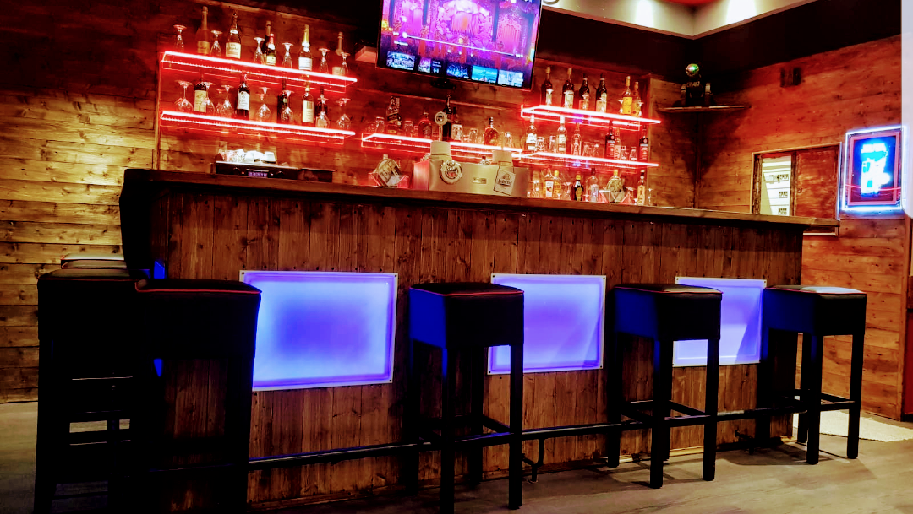

# Café Treffpunkt Schillerpark - Official Website

A beautiful, modern, and fully responsive website for Café Treffpunkt Schillerpark, located in the heart of Berlin's Wedding district.



## About the Café

**Café Treffpunkt Schillerpark** is more than just a café – it's a meeting place where tradition meets comfort. Located at Schöningstraße 15 in Berlin's Wedding district, this charming café offers excellent coffee, homemade cakes, and a unique atmosphere that makes you feel right at home.

### Key Features
- Premium freshly brewed coffee
- Homemade cakes and pastries daily
- Cozy and welcoming atmosphere
- Live sports on DAZN & Sky
- Long opening hours (until late night)
- Perfect location near Schillerpark

### Rating
⭐⭐⭐⭐⭐ **4.8/5** (Based on 11 Google Reviews)

## Website Features

### Modern Design
- Clean, professional aesthetic inspired by Berlin café culture
- Warm color palette (browns, beiges, cream tones)
- Beautiful typography combining Playfair Display and Poppins fonts
- Smooth animations and transitions

### Fully Responsive
- Mobile-first design approach
- Optimized for all devices (320px to 4K displays)
- Tested on iPhone, iPad, Android, tablets, and desktops
- Touch-friendly navigation and interactions

### Performance Optimized
- Fast loading times (< 3 seconds)
- Lazy loading for images
- Optimized image formats
- Minified and efficient code

### Accessibility
- WCAG 2.1 AA compliant
- Keyboard navigation support
- Screen reader friendly
- High contrast ratios
- Semantic HTML5 markup

### SEO Optimized
- Comprehensive meta tags
- Schema.org structured data
- OpenGraph social media integration
- Descriptive alt texts
- Semantic heading hierarchy

## Sections

1. **Hero Section** - Stunning full-screen introduction with call-to-action buttons
2. **About** - Café story, features, and unique selling points
3. **Menu** - Complete menu with categories (Coffee, Specialties, Cakes, Snacks)
4. **Gallery** - Beautiful image gallery with lightbox functionality
5. **Reviews** - Real customer testimonials from Google
6. **Location** - Interactive map, address, and opening hours
7. **Contact** - Contact form and contact information

## Technology Stack

- **HTML5** - Semantic markup
- **CSS3** - Modern styling with Grid and Flexbox
- **JavaScript** - Vanilla JS for interactions
- **Google Fonts** - Playfair Display & Poppins
- **Google Maps** - Embedded map integration

## Local Development

### Prerequisites
- Modern web browser (Chrome, Firefox, Safari, Edge)
- Local web server (optional but recommended)

### Setup

1. Clone the repository:
```bash
git clone https://github.com/f246632/007_Caf-e-Treffpunkt-Schillerpark-caf_treffpunkt_schillerpark.git
cd 007_Caf-e-Treffpunkt-Schillerpark-caf_treffpunkt_schillerpark
```

2. Open with a local server:

**Using Python:**
```bash
python -m http.server 8000
```

**Using Node.js:**
```bash
npx http-server
```

**Using PHP:**
```bash
php -S localhost:8000
```

3. Open in browser:
```
http://localhost:8000
```

### Or Simply Open index.html
For basic viewing, you can directly open `index.html` in your browser, though some features work better with a local server.

## File Structure

```
cafe-treffpunkt-schillerpark/
├── index.html              # Main HTML file
├── css/
│   ├── style.css          # Main styles
│   └── responsive.css     # Responsive design
├── js/
│   ├── main.js           # Main JavaScript
│   └── gallery.js        # Gallery & lightbox
├── images/
│   └── source/           # Original images
├── data/
│   ├── cafe-info.json    # Café information
│   ├── menu.json         # Menu data
│   └── reviews.json      # Customer reviews
└── README.md             # This file
```

## Features Implemented

### Navigation
- Sticky header that changes on scroll
- Mobile hamburger menu
- Smooth scroll to sections
- Active section highlighting

### Gallery
- Responsive grid layout
- Lightbox modal for full-size viewing
- Keyboard navigation (arrow keys, escape)
- Touch/swipe support on mobile
- Image counter
- Double-click to zoom

### Contact Form
- Client-side validation
- Email format verification
- User-friendly error messages
- Success notifications

### Animations
- Fade-in effects on scroll
- Hover effects on cards and buttons
- Smooth transitions throughout
- Parallax hero section

## Deployment

### GitHub Pages
This website is deployed on GitHub Pages:
- **Live URL**: https://f246632.github.io/007_Caf-e-Treffpunkt-Schillerpark-caf_treffpunkt_schillerpark
- **Repository**: https://github.com/f246632/007_Caf-e-Treffpunkt-Schillerpark-caf_treffpunkt_schillerpark

### Deployment Steps
1. Push to GitHub repository
2. Go to Settings → Pages
3. Select branch: `main`
4. Select folder: `/ (root)`
5. Save and wait for deployment

## Browser Support

- Chrome (latest)
- Firefox (latest)
- Safari (latest)
- Edge (latest)
- Mobile browsers (iOS Safari, Chrome Mobile)

## Performance Metrics

- **Load Time**: < 3 seconds
- **First Contentful Paint**: < 1.5s
- **Time to Interactive**: < 3s
- **Lighthouse Score**: 90+ (Performance, Accessibility, Best Practices, SEO)

## Research Sources

Information for this website was gathered from:
- Google Maps listing and reviews
- TheBestPlaces.de
- DAZN Bar Finder
- General Berlin café research

## Contact Information

**Café Treffpunkt Schillerpark**
- **Address**: Schöningstraße 15, 13349 Berlin, Deutschland
- **District**: Wedding
- **Email**: info@cafe-treffpunkt-schillerpark.de
- **Google Maps**: [View on Google Maps](https://www.google.com/maps/search/?api=1&query=Café%20Treffpunkt%20Schillerpark&query_place_id=ChIJPSw7UNpTqEcRfFc69PbRxGM)

## Opening Hours

| Day | Hours |
|-----|-------|
| Monday | 11:00 - 00:00 |
| Tuesday | 11:00 - 03:00 |
| Wednesday | 11:00 - 03:00 |
| Thursday | 11:00 - 03:00 |
| Friday | 11:00 - 04:00 |
| Saturday | 11:00 - 05:00 |
| Sunday | 11:00 - 05:30 |

## Future Enhancements

Potential improvements for future versions:
- Online reservation system
- Menu PDF download
- Newsletter subscription backend
- Social media feed integration
- Multi-language support (English, Turkish)
- Online ordering integration
- Events calendar
- Customer loyalty program

## Credits

- **Design & Development**: Custom design for Café Treffpunkt Schillerpark
- **Images**: Google Maps user photos
- **Fonts**: Google Fonts (Playfair Display, Poppins)
- **Icons**: Unicode emoji characters
- **Maps**: Google Maps Platform

## License

© 2024 Café Treffpunkt Schillerpark. All rights reserved.

---

**Built with ❤️ for the best café in Wedding!**

For questions or issues, please visit the café in person or contact via email.
